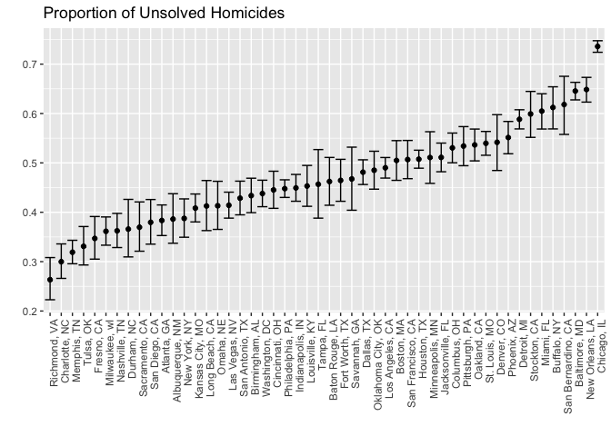

HW 5
================
Melanie Mayer
11/5/2018

Problem 1
---------

Below I will read in, merge, and tidy all the data

``` r
study_data = 
  tibble(names = list.files("./data/"),
         comp_names = str_c("./data/", names)) %>% 
  mutate(study_data = map(comp_names, read_csv)) %>% 
  unnest() %>%
  separate(names, into = c("type", "subject"), sep = "_") %>%
  separate(subject, into = c("subject", "remove"), sep = "\\.") %>%
  select(-c(comp_names, remove)) %>%
  gather(key = week, value = obs, week_1:week_8) %>%
  separate(week, into = c("remove", "week"), sep = "_") %>%
  select(-c(remove)) %>%
  mutate(type = factor(type),
         subject = factor(subject),
         week = as.integer(week))
```

Below is a spaghetti plot showing observations on each subject over time

``` r
ggplot(study_data, aes(x = week, y = obs, color = subject)) + 
  geom_line() +
  facet_grid(~type)
```


Looking at the spaghetti plots we can see the general trends of the two groups. While the control group seems rather stagnent here does seem to be an upward trend in the experimental group.

Problem 2
---------

Import and explore data

``` r
homicide_data = 
  read_csv("https://raw.githubusercontent.com/washingtonpost/data-homicides/master/homicide-data.csv")
```

``` r
homicide_data = homicide_data %>%
  mutate(city_state = str_c(city, ", ", state),
         disposition = factor(disposition)) %>%
  group_by(city_state, disposition) %>%
  mutate(unsolved_hom = n())

homicide_data_filtered = homicide_data %>%
  select(c(city_state, disposition, unsolved_hom)) %>%
  distinct(city_state, disposition, .keep_all = T) %>%
  spread(key = disposition, value = unsolved_hom) %>%
  janitor::clean_names() %>%
  replace_na(list(closed_without_arrest = 0, open_no_arrest = 0, closed_by_arrest = 0)) %>%
  mutate(total_unsolved = closed_without_arrest + open_no_arrest,
         total_hom = closed_without_arrest + open_no_arrest + closed_by_arrest)

baltimore_data = homicide_data_filtered %>%
  filter(city_state == "Baltimore, MD")

baltimore_prop = prop.test(baltimore_data$total_unsolved, baltimore_data$total_hom) %>%
  broom::tidy() %>%
  select(c(estimate, conf.low, conf.high))


prop_tests = homicide_data_filtered %>%
  mutate(prop_output = map2(total_unsolved, total_hom, prop.test)) %>%
  mutate(prop_output = map(prop_output, broom::tidy)) %>%
  unnest() %>%
  select(c(city_state, estimate, conf.low, conf.high))
```

    ## Warning in .f(.x[[1L]], .y[[1L]], ...): Chi-squared approximation may be
    ## incorrect

``` r
prop_tests %>%
  ungroup(city_state) %>%
  filter(city_state != "Tulsa, AL") %>%
  mutate(city_state = fct_reorder(city_state, estimate)) %>%
  ggplot(aes(x = city_state, y = estimate)) +
    geom_point() + 
    geom_errorbar(aes(ymin = conf.low, ymax = conf.high)) +
    theme(axis.text.x = element_text(angle = 90, hjust = 1)) +
    labs(x = "",
         y = "",
         title = "Proportion of Unsolved Homicides")
```


