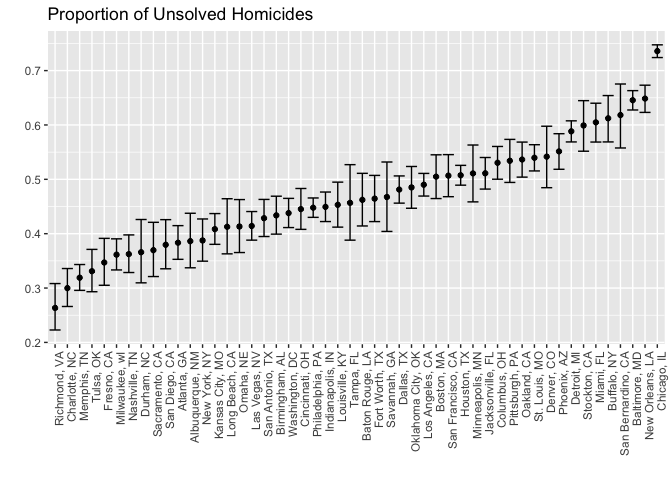

HW 5
================
Melanie Mayer
11/5/2018

Problem 1
---------

Below I will read in, merge, and tidy all the data.

``` r
#dataframe w/ all file names
file_names = list.files("./data/")

#merge all data frames, extract info wanted, tidy data
study_data = 
  tibble(file_names = str_c("./data/", file_names)) %>% 
  mutate(study_data = map(file_names, read_csv)) %>% 
  unnest() %>%
  separate(file_names, into = c("type", "subject"), sep = "_") %>%
  separate(subject, into = c("subject", "remove"), sep = "\\.") %>%
  separate(type, into = c("remove1", "remove2", "type"), sep = "/") %>%
  select(-c(remove, remove1, remove2)) %>%
  gather(key = week, value = obs, week_1:week_8) %>%
  separate(week, into = c("remove", "week"), sep = "_") %>%
  select(-c(remove)) %>%
  mutate(type = factor(type),
         subject = factor(subject),
         week = as.integer(week))

#assure process done correctly
head(study_data) %>%
  knitr::kable()
```

| type | subject |  week|   obs|
|:-----|:--------|-----:|-----:|
| con  | 01      |     1|  0.20|
| con  | 02      |     1|  1.13|
| con  | 03      |     1|  1.77|
| con  | 04      |     1|  1.04|
| con  | 05      |     1|  0.47|
| con  | 06      |     1|  2.37|

Below is a spaghetti plot showing observations on each subject over time.

``` r
study_data %>%
  mutate(type = fct_recode(type, "Control" = "con", "Experiment" = "exp")) %>%
  ggplot(aes(x = week, y = obs, color = subject)) + 
  geom_line() +
  ylab("Observation") +
  facet_grid(~type)
```


Looking at the spaghetti plots we can see the general trends of the experimental group compared to the control group. While the control group seems rather stagnant there does seem to be an upward trend in the experimental group. Because I do not know what we were testing, not much more can be said. There is a lot of variation from week to week, but comparing week one to week eight there is a rise in all 10 experimental subjects.

Problem 2
---------

Import and explore data

``` r
homicide_df = read_csv("https://raw.githubusercontent.com/washingtonpost/data-homicides/master/homicide-data.csv")
```

The dataset shows 52179 criminal homicides since 2007 in 50 of the largest cities in the USA. A total of 12 variables are used to describe the homicides. These include the following: For each homicide information is given on the victim's age, race, and sex. The location of the incident described by the city, state, and longitudinal/latitudinal point is specified. The outcome of the homicide, i.e. whether it resulted in an arrest, is also presented.

I will do some data manipulations below.

``` r
#create df with city_state, total number of homicides, and number of unsolved homicides variables

homicide_df_selected = homicide_df %>%
  mutate(city_state = str_c(city, ", ", state),
         disposition = factor(disposition)) %>%
  group_by(city_state, disposition) %>%
  mutate(total_per_disposition = n()) %>%
  select(c(city_state, disposition, total_per_disposition)) %>%
  distinct(city_state, disposition, .keep_all = T) %>%
  spread(key = disposition, value = total_per_disposition) %>%
  janitor::clean_names() %>%
  replace_na(list(closed_without_arrest = 0, open_no_arrest = 0, closed_by_arrest = 0)) %>%
  mutate(total_unsolved = closed_without_arrest + open_no_arrest,
         total_hom = closed_without_arrest + open_no_arrest + closed_by_arrest)
```

Now that I have the variables I am interested in I will run some tests.

I begin by estimating the proportion of homicides that are unsolved in Baltimore, MD.

``` r
#filter out Baltimore
baltimore_data = homicide_df_selected %>%
  filter(city_state == "Baltimore, MD")

#run test of proportion
baltimore_prop = prop.test(baltimore_data$total_unsolved, baltimore_data$total_hom) %>%
  broom::tidy() %>%
  select(c(estimate, conf.low, conf.high))

#View results
baltimore_prop %>%
  knitr::kable()
```

|   estimate|   conf.low|  conf.high|
|----------:|----------:|----------:|
|  0.6455607|  0.6275625|  0.6631599|

Next I will extend this test to all 50 (51 including Tulsa, AL) cities in the dataset.

``` r
#test for the proportion of unsolved homicides per city
prop_tests = homicide_df_selected %>%
  mutate(prop_output = map2(total_unsolved, total_hom, prop.test)) %>%
  mutate(prop_output = map(prop_output, broom::tidy)) %>%
  unnest() %>%
  select(c(city_state, estimate, conf.low, conf.high))
 

#view results
prop_tests %>% 
  knitr::kable()
```

| city\_state        |   estimate|   conf.low|  conf.high|
|:-------------------|----------:|----------:|----------:|
| Albuquerque, NM    |  0.3862434|  0.3372604|  0.4375766|
| Atlanta, GA        |  0.3833505|  0.3528119|  0.4148219|
| Baltimore, MD      |  0.6455607|  0.6275625|  0.6631599|
| Baton Rouge, LA    |  0.4622642|  0.4141987|  0.5110240|
| Birmingham, AL     |  0.4337500|  0.3991889|  0.4689557|
| Boston, MA         |  0.5048860|  0.4646219|  0.5450881|
| Buffalo, NY        |  0.6122841|  0.5687990|  0.6540879|
| Charlotte, NC      |  0.2998544|  0.2660820|  0.3358999|
| Chicago, IL        |  0.7358627|  0.7239959|  0.7473998|
| Cincinnati, OH     |  0.4452450|  0.4079606|  0.4831439|
| Columbus, OH       |  0.5304428|  0.5002167|  0.5604506|
| Dallas, TX         |  0.4811742|  0.4561942|  0.5062475|
| Denver, CO         |  0.5416667|  0.4846098|  0.5976807|
| Detroit, MI        |  0.5883287|  0.5687903|  0.6075953|
| Durham, NC         |  0.3659420|  0.3095874|  0.4260936|
| Fort Worth, TX     |  0.4644809|  0.4222542|  0.5072119|
| Fresno, CA         |  0.3470226|  0.3051013|  0.3913963|
| Houston, TX        |  0.5074779|  0.4892447|  0.5256914|
| Indianapolis, IN   |  0.4493192|  0.4223156|  0.4766207|
| Jacksonville, FL   |  0.5111301|  0.4820460|  0.5401402|
| Kansas City, MO    |  0.4084034|  0.3803996|  0.4370054|
| Las Vegas, NV      |  0.4141926|  0.3881284|  0.4407395|
| Long Beach, CA     |  0.4126984|  0.3629026|  0.4642973|
| Los Angeles, CA    |  0.4900310|  0.4692208|  0.5108754|
| Louisville, KY     |  0.4531250|  0.4120609|  0.4948235|
| Memphis, TN        |  0.3190225|  0.2957047|  0.3432691|
| Miami, FL          |  0.6048387|  0.5685783|  0.6400015|
| Milwaukee, wI      |  0.3614350|  0.3333172|  0.3905194|
| Minneapolis, MN    |  0.5109290|  0.4585150|  0.5631099|
| Nashville, TN      |  0.3624511|  0.3285592|  0.3977401|
| New Orleans, LA    |  0.6485356|  0.6231048|  0.6731615|
| New York, NY       |  0.3875598|  0.3494421|  0.4270755|
| Oakland, CA        |  0.5364308|  0.5040588|  0.5685037|
| Oklahoma City, OK  |  0.4851190|  0.4467861|  0.5236245|
| Omaha, NE          |  0.4132029|  0.3653146|  0.4627477|
| Philadelphia, PA   |  0.4478103|  0.4300380|  0.4657157|
| Phoenix, AZ        |  0.5514223|  0.5184825|  0.5839244|
| Pittsburgh, PA     |  0.5340729|  0.4942706|  0.5734545|
| Richmond, VA       |  0.2634033|  0.2228571|  0.3082658|
| Sacramento, CA     |  0.3696809|  0.3211559|  0.4209131|
| San Antonio, TX    |  0.4285714|  0.3947772|  0.4630331|
| San Bernardino, CA |  0.6181818|  0.5576628|  0.6753422|
| San Diego, CA      |  0.3796095|  0.3354259|  0.4258315|
| San Francisco, CA  |  0.5067873|  0.4680516|  0.5454433|
| Savannah, GA       |  0.4674797|  0.4041252|  0.5318665|
| St. Louis, MO      |  0.5396541|  0.5154369|  0.5636879|
| Stockton, CA       |  0.5990991|  0.5517145|  0.6447418|
| Tampa, FL          |  0.4567308|  0.3881009|  0.5269851|
| Tulsa, AL          |  0.0000000|  0.0000000|  0.9453792|
| Tulsa, OK          |  0.3310463|  0.2932349|  0.3711192|
| Washington, DC     |  0.4379182|  0.4112495|  0.4649455|

The plot below demonstrates the results found above.

``` r
#plot of confidence interval per city
#Tulsa, AL removed for purposes of the plot, only has one observation therefore very imprecise CI

prop_tests %>%
  ungroup(city_state) %>%
  filter(city_state != "Tulsa, AL") %>%
  mutate(city_state = fct_reorder(city_state, estimate)) %>%
  ggplot(aes(x = city_state, y = estimate)) +
    geom_point() + 
    geom_errorbar(aes(ymin = conf.low, ymax = conf.high)) +
    theme(axis.text.x = element_text(angle = 90, hjust = 1)) +
    labs(x = "",
         y = "",
         title = "Proportion of Unsolved Homicides")
```


